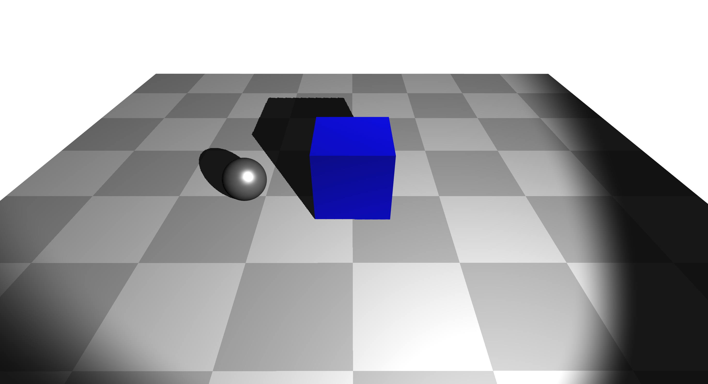
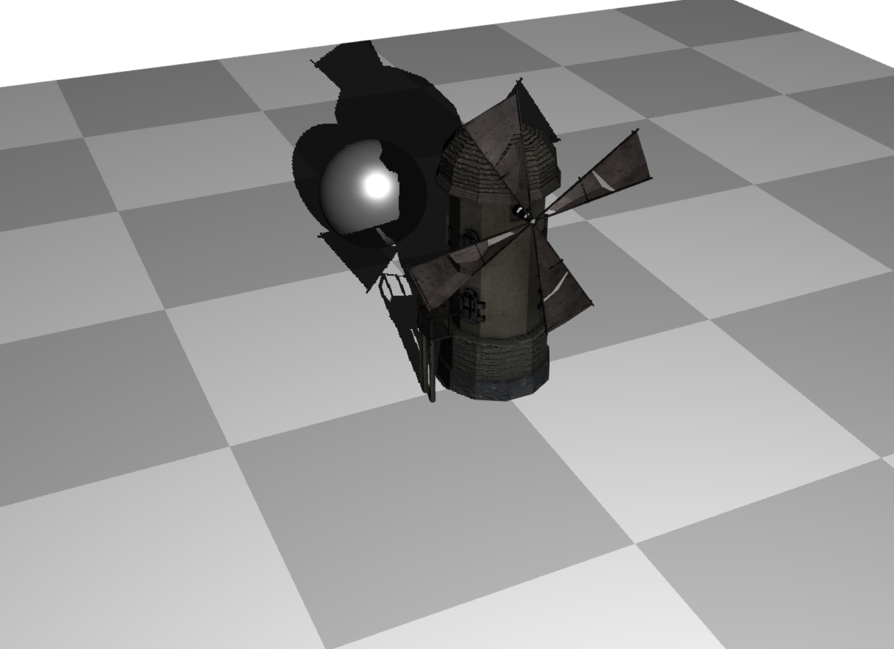

# Interactive Graphics Final Project (2023/2024)

This repository contains the code for the final project of Interactive Graphics course (2023/2024) at Sapienza University of Roma. The project is built using WebGL1, Vite, and Yarn.

## Table of Contents
- [Introduction](#introduction)
- [Features](#features)
- [Installation](#installation)
- [Usage](#usage)
- [Project Structure](#project-structure)

## Introduction
This project demonstrates various techniques in interactive graphics, including scene graph implementation, shadow mapping, spotlights, and simple animations. Helper classes are also provided to facilitate loading OBJ and GLTF files into the scene graph structure as well as setting up WebGL states.
### Fall Scene
<p align="center">
  
  <br>
  <em>Gif showing the final rendered scene with low quality :D.</em>
</p>

### Sphere and Cube with Spotlight and Shadow Mapping
<p align="center">
  
</p>

### Windmill with Spotlight and Shodow Mapping
<p align="center">
  
</p>


## Features
- Scene Graph
- Shadow Mapping
- Spot Light
- Simple Animations
- OBJ and GLTF File Loaders
- Utility functions for WebGL

## Installation
To get started with the project, follow these steps:

1. Clone the repository:
    ```bash
    git clone https://github.com/mosix11/IG-Final-Project.git
    cd IG-Final-Project
    ```

2. Install dependencies:
    ```bash
    yarn install
    ```

3. Start the development server:
    ```bash
    yarn dev
    ```

## Usage
Once the development server is running, you can open your browser and navigate to the provided local URL to view the project. The main rendered scene and interactive elements will be displayed.

## Project Structure
### Utility Folder
- `scene.js`: Implementation of `Scene Graph`, `Scene Node`, and `Camera` classes.
- `obj_parser.js`: Wavefront OBJ-MTL file loader. This script uses ThreeJS to load the models and then extracts the information needed to render the objects in the form of a Scene Node.
- `gltf_loader.js`: Same as OBJ pareser but for GLTF files (handles simple GLTF files only).
- `mesh_gen.js`: Functions for building simple geometeries as well as elements of the main scene.
- `utils.js` & `webgl-utils.js`: Helper functions for setting up WebGL states (webgl-utils from webglfundamentals but modified to support reading shaders from public file directories).

### Public Folder
- `models`: Contains the 3D models used in the project.
- `shaders`: Contains the vertex and fragment shaders used in the project.
